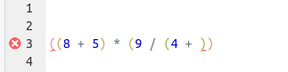

```{r knitr_options, echo=FALSE}
knitr::opts_chunk$set(results='hide',
                      eval = FALSE,
                      class.source="r_code",
                      class.output="r_output",
                      class.warning="r_warning",
                      class.message="r_warning",
                      class.error="r_error")

folder_name <- "2020-12_microbiomics-workshop"
```

```{r klippy, echo=FALSE, include=TRUE}
klippy::klippy(position = 'right',
               tooltip_message = "Copy code to clipboard",
               tooltip_success = "Copied!")
```

<br>

> ## Learning Objectives
>
> * Get some basic familiarity with R and RStudio
> * Learn why and how to use RStudio Projects
> * Understand objects, functions, and how to use them
> * Understand the concepts of `vector` and `data.frame`
> * Explore the structure and the content of a `data.frame`
> * Learn about how R handles missing data

------------

## Before We Get Started

### Attribution

This material was modified after material from [The Carpentries](https://carpentries.org/),
especially from [this Data Carpentry workshop](http://uw-madison-aci.github.io/2016-06-01-uwmadison/)
and [this "R for Ecology" workshop](https://datacarpentry.org/R-ecology-lesson).

### Why R?

R is a versatile, open source programming/scripting language that's particularly
useful for *statistics* and *data visualization*.

**Yes, there is a learning curve, and many of us just want to get on with our analysis --    
but investing in learning R will pay off:**

- R gives you greater **flexibility** to do anything you want.

- A greater **reproducibility** of scripting vs clicking.

- R is highly **interdisciplinary** -- e.g. very useful for analyzing sequencing data  
  but can also be used to create maps and perform GIS analyses, and so on!

- R is more than a platform to perform analysis.
  When combined with *Markdown* (a very simple text markup language),
  you can easily use R to produce reports that integrate code, results, and text,
  as well as for websites, slide decks, books, and so on!

Furthermore, R:

- Is freely available on all platforms, and open source.

- Has a large and welcoming user community.

-----

## Getting Started

### Start an RStudio Server session at OSC {#rstudio-at-OSC}

- Login to OSC at <https://ondemand.osc.edu>.

- Click on `Interactive Apps` (top bar) > `RStudio Server (Owens and Pitzer)`

<p align="center">

</p>

- Fill out the form as shown [here](slides/03-OSC-slides.html#rstudio_server_job).

- Now, you should see a box like this:

<p align="center">

</p>

- Your job should start running pretty soon, and when it's ready the box should look like this: 

<p align="center">

</p>

- Click `Connect to RStudio Server` at the bottom of the box, and an RStudio Server instance will open. You're ready to go!

### R vs. RStudio

R simply provides a "*console*" to type your commands.
However, because you want to save your sequences of commands in scripts,
regularly examine output such a graphics, and so on,
you can work much more effectively in an environment that provides all of this
side-by-side.

We will use RStudio, an excellent "Integrated Development Environment" (IDE) for R.
In RStudio, we have a *single interface* to write code, navigate the files found on our computer,
inspect the objects we create, and visualize the plots we generate.

RStudio is divided into 4 "panes":

- **_Top-left_**: The **editor** for your scripts and documents.
- **_Bottom-left_**: The **R console**.
- **_Top-right_**: Your environment/history.
- **_Bottom-left_**: Your files/plots/packages/help/viewer.
  
The placement of these panes and their content can be customized.


-----

## Interacting with R

### R as a calculator

The lower-left RStudio pane, i.e. **the R console**,
is where you can interact with R directly.

The `>` sign is the R "prompt".
It indicates that R is ready for you to type something.

Let's start by performing a division:

```{r add, eval=TRUE, results='show'}
203 / 2.54
```

R does the calculation and prints the result, and then you get the `>` prompt again.
(The `[1]` may look a bit weird when there is only one output element; 
this is how you can keep count of output elements.)

With the standard symbols you can use R as a general calculator:

```{r calculations, eval = TRUE, results='show'}
203 * 2.54   # Multiplication
203 + 2.54   # Addition
```


### Trying some random things...

```{r space, eval=TRUE, results="show"}
         203                     - 2.54
```

This works: so R just ignores any extra spaces.

<br>

How about:

```{r hanging_prompt}
203 +
```

<details>
<summary>
&nbsp;  `r icon::fa("question-circle")` &nbsp; **Now the prompt is a `+`. What is going on?**
</summary>

R is waiting for you to finish the command, since you typed an incomplete command:
something has to come after the `+` to be added to what came before.

While it was obvious here, you will often type incomplete commands without
realizing you did so.
Just remember that when you see the `+` prompt,
you are missing something in your command:
often, you'll have forgotten a closing parenthesis `)`
or you accidentally opened up an unwanted opening parenthesis `(`.

Note also that RStudio will alert you in the script window when you are making syntax errors:

<p align="center">

</p>

</details>

<br>

And if we just type a number:

```{r number, eval=TRUE, results='show'}
203
```

R will print the number back to us!
It turns out that the default, implicit action that R will perform
on anything you type is to print it back to us
(it is calling a function called `print()` under the hood).

<br>

What if we try that with some text?

```{r gibberish, eval=TRUE, results='show', error=TRUE}
Awesome
```


<details>
<summary>
&nbsp;  `r icon::fa("question-circle")` &nbsp; **What seems to be going wrong here?**
</summary>

Whenever you type a character string, R expects to find an object with that name.
(Or, if you would use parentheses after the string, like `string()`,
it will expect a function.)

</details>

<br>


We *can* get R to print character strings back to us,
and work with them in other ways, as long as we quote the strings:

```{r print_char, eval=TRUE, results='show'}
"Well, I'm really liking R so far."
```

----

## Getting Organized

### Need for Scripts

We can go along like this, typing commands directly into the R console.
But to better keep track of what you're doing,
it's a good idea to write your code in files, i.e. "**scripts**".
And when we start creating scripts, we need to worry about how we
organize the scripts and data for a project.

So let's pause for a moment and talk about file organization.

### Need for RStudio Projects

It is good practice to keep a set of related data, analyses, and text
self-contained in a single folder,
and use that folder as the **working directory**.

Then, all of the scripts within this folder can use *relative paths* to files
that indicate where inside the project a file is located
(as opposed to *absolute paths*,
which point to where a file is *on a specific computer*).

<details>
<summary>
&nbsp;  `r icon::fa("info-circle")` &nbsp; More on absolute vs relative paths (click here)
</summary>

An absolute path always contains the *root element* (`/` on Unix systems such as
Linux and Mac; typically `C:\` on Windows) and the complete directory list
to locate file. For that reason, if you move a file around on your computer,
or move it to a different computer, an absolute path will practically never work.
On the other hand, as long as the files remains in the same location,
you can refer to it with an absolute path regardless of where you are on your computer.

```{bash, eval=FALSE}
C:\Documents\2020-12_microbiomics-workshop\scripts\intro-to-R.R  # An absolute path

scripts/intro-to-R.R                                             # A relative path
```

<br>

A relative path assumes a certain starting point (the "working directory"),
so you need to be at the correct starting point for the path to work.
On the other hand, if you keep all files associated with a project within
a single parent directory, and keep the internal directory structures constant,
a relative path will keep working, even if you move the project directory,
open it on a different computer, or share it with a collaborator.

**You should avoid using absolute paths as much as possible.**

`r icon::fa("info-circle")` In R you can always use a
forward slash `/` to delimit directories, even if you are on a Windows machine.*

</details>

<br>

Working this way makes it a lot easier to move your project around on your computer
and share it with others without worrying whether the paths in the scripts
will still work.

A challenge of using relative paths is that you need to make sure you are
always at the same starting point (your *working directory*).
RStudio provides a helpful way to
**keep your working directory constant through its "Projects"**.
When you use a Project, your working directory will *always* be the top-level
directory of that project,
and you can safely use relative paths to point to other files.

### Create an RStudio Project:

We'll use the `create_project()` function from the *usethis* package
to create a new RStudio Project. The directory should contain our user name,
so we first get our user name and build the path:

```{r}
# Get your user name (by running a shell command via the `system()` function:
me <- system("echo $USER", intern = TRUE)
# Build the path to the target dir:
proj_dir <- file.path('/fs/project/PAS0471/workshops/2020-12_micro', me)

# Create the Project:
library(usethis)
create_project(path = proj_dir)
```

Now, RStudio will reload with the newly created Project open.

If you get the pop-up below, click `Don't Save` (do this whenever you get that pop-up):

<p align="center">

</p>


Your working directory should be the Project's directory.
We can check this using `getwd()`:

```{r}
getwd()
```

From now on, we will not change our working directory,
and refer to all files relative to our project's top-level directory.


### Creating an R script

- Create a new R script (`File` > `New File` > `R Script`)

- Click `File` > `Save As` to save the script in the `scripts` dir that you
  should see within your personal dir.
  Give it a descriptive name like `intro-to-R.R`.
  

### Interacting with the R console from your script

I recommend always *typing your commands into a script*
and executing the commands from there.

We want to make sure to save our division,
so start by typing the following into the R script in the top-left pane:

```{r}
203 / 2.54
```

With the cursor still on this line,
press <kbd>`Ctrl`</kbd> + <kbd>`Enter`</kbd>.
The command will be copied to the R console and executed,
and then the cursor will move to the next line.
(You can also highlight multiple lines of code and execute them all at
once with <kbd>`Ctrl`</kbd> + <kbd>`Enter`</kbd>.)

### Commenting

Use `#` signs to comment your code.
Anything to the right of a `#` is ignored by R, meaning it won't be executed.
You can use `#` both at the start of a line or anywhere in a line following code.

Comments are a great way to describe what your code does within the code itself,
so comment liberally in your R scripts!

----

## Objects

### Assigning stuff to objects

We can assign pretty much anything to an object with the assignment
operator, `<-`^[In RStudio, typing <kbd>Alt</kbd> + <kbd>-</kbd> will write ` <- ` in
a single keystroke. You can also use `=` as assignment, but that symbol can have other
meanings, and so I recommend sticking with the `<-` combination.].
(This is a smaller-than sign `<` followed by a dash `-`.)
For example:

```{r assign, eval=TRUE}
wingspan_in <- 203 / 2.54
```

Type that into your script,
and use <kbd>`Ctrl`</kbd> + <kbd>`Enter`</kbd> to send it to the console.

If you've assigned a number to an object, you can then use it in
other calculations:

```{r sqrt, eval=TRUE, results='show'}
wingspan_in * 2.54
```

### Object names

Objects can be given any name such as `x`, `current_temperature`, or
`subject_id`.

Some pointers on object names:

- Make them descriptive yet not too long.

- They cannot start with a number (`2x` is not valid, but `x2` is)^[There are some names that
cannot be used because they are the names of fundamental functions in R (e.g.,
`if`, `else`, `for`, see
[here](https://stat.ethz.ch/R-manual/R-devel/library/base/html/Reserved.html)
for a complete list). In general, even if it's allowed, it's best to not use
other function names (e.g., `c`, `T`, `mean`, `data`, `df`, `weights`). In doubt
check the help to see if the name is already in use.].

- Note: R is case sensitive (e.g., `weight` is different from `Weight`).

- A style recommendation is to avoid capital letters (e.g., `totalWeight`)
  and dots (`total.weight`) to separate words. Instead, stick to lowercase,
  and use underscores (`total_weight`) to separate words.^[It is also recommended
  to use nouns for variable names, and verbs for function names.
  It's important to be consistent in the styling of your code
  (where you put spaces, how you name variables, etc.).
  In R, two popular style guides are [Hadley Wickham's](http://adv-r.had.co.nz/Style.html)
  and [Google's](https://google.github.io/styleguide/Rguide.xml).]

<div class="alert puzzle">
<div>

#### Challenge

What is the value of `y` after doing all of the following?

```{r, eval=FALSE}
x <- 50
y <- x * 2
x <- 80
```

<details>

<summary>
&nbsp;  `r icon::fa("check-circle")` &nbsp; Solution (click here)
</summary>

Objects don't get linked to each other, so if you change one,
it won't affect the values of any others.
Therefore, `y` will keep the value `100`.

</details>

</div>
</div>

### Objects in your workspace

The objects you create get added to your "workspace". You can list the
current objects with `ls()`. RStudio also shows the objects in the
**Environment panel.**


----

## Functions

Earlier, we divided `203` by `2.54`,
but what if we wanted to round the resulting number?
Like for many things you may want to do in R, there is a **function** for that.

Functions are used by typing their name followed by parentheses:

```{r log, eval=TRUE, results='show'}
round(203 / 2.54)
```

Here, `round()` is a _function_ that rounds a number.
The value in the parentheses is called a function "*argument*",
which is used in the execution of the function.

### Using named arguments

Functions can have more than one argument, and some of them may have default values.

There are some functions that take many arguments and it can get confusing
trying to keep them in order.
In that case, it is better to explicitly name the arguments.

When you type a function name and pause for a moment,
the arguments, their names, and their default values
(i.e., the value if the argument is left unspecified) will be shown.

<details>
<summary>
&nbsp;  `r icon::fa("question-circle")` &nbsp; What is the second argument for `round()` and what is its default value? (Click here)
</summary>

`round` has a second argument `digits` whose default 
is `0`, such that numbers will be rounded to whole integers.

</details>

<br>

Below is an example using named arguments with `round()`.
When the arguments are named, the order doesn't matter!
You might also enter the first few important arguments positionally,
and later ones by naming them.

```{r round_w_named_args}
round(x = 1.538462, digits = 2)

round(digits = 2, x = 1.538462)

round(1.538462, digits = 2)
```

<br>

Also here, we can directly plug in objects:

```r
wingspan_in <- 203 / 2.54
round(wingspan_in)
```

Or nest functions -- here we are adding the `log()` function:

```r
log(round(203 / 2.54 ))
```

<details>

<summary>
&nbsp;  `r icon::fa("question-circle")` &nbsp; **What is the order of execution in the last command?** (Click here)
</summary>

`round()` is executed first,
and the output of `round()` is used as the input of `log()`.

</details>

<br>

-----

## Getting help

As we saw, when we typed `round` and paused for a moment,
we got a pop-up with information about the function.

Alternatively, you could type:

```{r help, eval=FALSE}
?round
```

... and the documentation for the function will show up in the lower-right pane.

This documentation is often a bit _too_ detailed, and can be terse,
so it takes some practice to read.
*Usage*, *Arguments*, and at the bottom, *Examples*, are most useful.

Googling what you want to do, even if you don't know whether a function
exists, will work too (e.g. "rounding a number in r").

----

## Vectors

A **vector** is the most common and basic data structure in R,
and is composed of a **series of values of the same type**.

We can assign a series of values to a vector using the `c()` function
(for "combine"). For example:

```{r, eval = TRUE}
wingspan_cm <- c(11.8, 203, 18.2, 27.9)
```

A vector can also contain characters -- but again, quoting is important,
or R will think the strings are objects:

```{r, eval = TRUE}
birds <- c("hummingbird", "bald_eagle", "chickadee", "cardinal")
```

<br>

As mentioned, all of a vector's elements are of the same type of data.   
The function `class()` indicates what kind of data you are working with:

```{r, eval = TRUE, results='show'}
class(wingspan_cm)
class(birds)
```

### Data types in R

The classes we saw above are different types of **atomic vectors**,
R's simplest **data type**.
The 4 most common atomic vector types are:

- **`"numeric"`** (or `"double"`) -- floating point numbers

- **`"character"`** -- character strings

- **`"logical"`** -- `TRUE` and `FALSE` (also known as boolean)

- **`"integer"`** -- integer numbers

<details>
<summary>
&nbsp; `r icon::fa("info-circle")` &nbsp; **Vector coercion**: when not all elements are of the same type. (Click here)
</summary>

What happens if we try to mix vector types (e.g., "character and numeric")
in a single vector?
**R converts them to all be the same type, and it does so without telling us about it.**

What will happen in each of the following examples?    
(Hint: use `class()` to check the data type of your objects)

```r
num_char <- c(1, 2, 3, "a")

num_logical <- c(1, 2, 3, TRUE)

char_logical <- c("a", "b", "c", TRUE)

tricky <- c(1, 2, 3, "4")
```

You've probably noticed that objects of different types get
converted into a single, shared type within a vector. In R, we
call converting objects from one class into another class
_coercion_. These conversions happen according to a hierarchy,
whereby some types get preferentially coerced into other
types.

</details>

<br>

### Vectorization!

Let's say we wanted to convert our vector of wingspans to inches:
dividing each length in centimeters by 2.54.

How could we do this quickly?

```{r, eval = TRUE, results = "show"}
# wingspan_cm <- c(11.8, 203, 18.2, 27.9)  # Still working with the same wingspan vector

wingspan_in <- wingspan_cm / 2.54
wingspan_in
```

<details>

<summary>
&nbsp;  `r icon::fa("info-circle")` &nbsp; Why does this work?
</summary>

R "*vectorizes*" operations whenever it can.
This means that in this case, each element in the vector `weights_cm` will be divided
by 2.54 -- this number is **recycled** to match the number of weights.

For a programming language, this is unusual behavior -- but it is very useful!

</details>

<br>

Similarly, we can use two vectors of equal length to quickly operate on each element
of the vector:

```{r eval = TRUE, results =  "show"}
size_cm <- c(7.62, 90, 13.1, 21.8)

ratio <- wingspan_cm / size_cm
ratio

```
<br>


### Data structures in R

While vectors can be composed of one of several *data types*, they, in turn,
are one of several **data structures** that R uses.
Other important ones are:

- **`data.frame`** -- A rectangular data structure where each column can be a
  different data type.

- **`matrix`** -- A rectangular data structure of a single data type.

- **`list`** -- A very flexible data structure that we will not further discuss here.

- **`factor`** -- Character strings with a discrete set of possible values,
  used mostly for statistical tests and when plotting.


----

## Data Frames

A data frame (formal object type: `data.frame`) is a rectangular data structure
in which:

  - Rows are observations and columns are variables.
  - Each column can be of a different type (numeric, character, etc.),
  - Since each column is a vector,
    all the values (cells) within a column are of the same type.
  - All columns have the same length.

### Create, write, and read a data frame

We can easily create a data frame by hand using the `data.frame()` function and
"`column_name = column_vector`" notation for each column:

```{r eval=TRUE, results='show'}
birds_df <- data.frame(species = birds,
                       wingspan = wingspan_cm,
                       size = size_cm,
                       n_eggs = c(2, 2, 7, 4)) 
```

Most often, however, you'll be reading your data frames from files.
And you'll also want to save your modified data frames.

So let's practice writing and reading a data frame:

```{r}
# Write a data frame to CSV format:
write.csv(x = birds_df, file = "bird-data.csv", row.names = FALSE)
```

Now we read our data frame back in:

```{r}
birds_df_2 <- read.csv('bird-data.csv')

## Let's compare the two data frames:
birds_df

birds_df_2
```

### Inspecting a Data Frame

Use `str()` to look at the structure of the data.

```{r str, eval=FALSE}
str(birds_df)
```

This tells us the number rows and columns,
and for each column, gives information about the data
type and shows the first few values.

Another useful function is `summary()`.

```{r summary, eval=FALSE}
summary(birds_df)
```

Finally, in RStudio, we can click on an object in the `Files` pane, or
equivalently, type:
  
  ```{r View, eval=FALSE}
View(birds_df)
```

### An Overview of Functions to Get an Overview

* **Size:**
  * `dim()` -- *Dim*ensions: c(number of rows, number of columns)
  * `nrow()` -- Number of rows
  * `ncol()` -- Number of columns
  * `length()` -- For a dataframe: number of columns. For a vector: number of elements.

* **Content:**
  * `head()` -- shows the first 6 rows
  * `tail()` -- shows the last 6 rows

* **Names:**
  * `names()` or `colnames()` -- column names
  * `rownames()` -- row names

* **Summary:**
  * `str()` -- structure of the object and information about the class, length and content of each column
  * `summary()` -- summary statistics for each column
  * `skimr::skim()` -- very nice summary, need to install *skimr* with `install.packages(skimr)`.


----

## Miscellaneous

### Missing data

As R was designed to analyze datasets, it includes the concept of missing data
(which is uncommon in other programming languages).
Missing data are represented as `NA` (for "Not Available").

```{r create_vec_with_missing}
heights <- c(2, 4, 4, NA, 6)
```

When doing operations on numbers, most functions will return `NA` if the data
you are working with include missing values. It is a safer behavior as otherwise
you may overlook that you are dealing with missing data.
You can add the argument `na.rm=TRUE` to calculate the result while ignoring the missing values.

```{r na_rm}
mean(heights)

mean(heights, na.rm = TRUE)
```

<br>

If your data includes missing values, you may want to become familiar with the
functions `is.na()` and `na.omit()`.

```{r extract_non_missing}
## Extract those elements which are not missing values:
heights[!is.na(heights)]

## Shortcut to do the same:
na.omit(heights)
```

### Packages

The functions that we have been using so far (and *many*, *many* more) are available
in any R session as soon as you start R (we refer to this functionality as *"base R"*).
However, when doing specialized analyses such as in microbiomics,
rather than coding up everything using the basic building blocks in R,
we can load add-on code that will allow us to use *"high-level"* functions
specifically geared towards the effective analyses of such data.

This type of add-on code is distributed in R *packages*.
The default *repository* for R packages is **CRAN**.
The packages on CRAN have undergone a certain level of vetting,
and can be easily installed with `install.packages()` function, for instance:

```{r, eval=FALSE}
install.packages("tidyverse")
```

If you’re doing bioinformatic analyses in R, as we will be doing,
you will encounter packages that are not on CRAN but are on "Bioconductor".
To install a package from Bioconductor, use the BiocManager package – for example:

```{r, eval=FALSE}
install.packages("BiocManager")  # Install the BiocManager package
BiocManager::install("dada2")    # Install the edgeR package from Bioconductor
```

### Saving your data

Some very brief notes on saving your data in R:

- We already saw the use of `write.csv()` to save data frames,
  and you can also use one of *readr*'s [writing     functions](https://readr.tidyverse.org/reference/write_delim.html).
  
- To save R objects "as is",
  which can be useful when you're working with complex S4 objects that may have
  taken a long time to generate, like a *phyloseq object*, you can use:
  
  ```{r, eval=FALSE}
  # Save an object:
  saveRDS(my_phyloseq_object, "my_phyloseq_object.RDS")
  
  # Load it again in a new R session:
  my_phyloseq_object <- readRDS("my_phyloseq_object.RDS")
  ```

- A general recommendation is to not rely on your R session to keep things around,
  especially "overnight". Devise your workflow such that you are always saving
  important objects and results outside of R,
  and can always use your R script to restart from where you left off.

### S4 Objects

While the object types we have discussed so far are so-called "*S3*" object,
we will also be seeing "*S4*" objects in this workshop. 
S4 object are commonly used by bioinformatics packages, for instance *phyloseq*.

In a nutshell, S4 objects allow for complicated, multifaceted datasets
(e.g. multiple dataframes with and metadata) to be represented in a single object
in a standardized way.

Unlike S3 objects, S4 objects are usually not manipulated by simple assignment
with `<-`, but with specialized functions that are sure to adhere to the
strict object definitions.

Its elements are called *slots*, which are accessed with `@` (`object_name@slot_name`). 

----

## Where to go from here

This document only scratched the surface of R,
but it has hopefully provided a good starting point for working with R.

My recommendations on where to go from here would be exactly the same
regardless of whether you just wanted to make general progress with R,
or wanted learn R things that you can apply when working with microbiomics packages.
They are:

1. Learn about data wrangling with tidyverse packages, especially *dplyr* and *tidyr*. Start [here](https://datacarpentry.org/R-ecology-lesson/03-dplyr.html)

2. Learn about plotting with *ggplot2*. Start [here](https://datacarpentry.org/R-ecology-lesson/04-visualization-ggplot2.html)

Both of those topics and some other material are also covered in this excellent
Carpentries workshop [R for Reproducible Scientific Analysis](https://swcarpentry.github.io/r-novice-gapminder/).

If you want to start with a book, I would recommend Wickham & Grolemund's
"R for Data Science", which is freely available on the web in a really nice format
[here](https://r4ds.had.co.nz/).

----

## Bonus Material: Subsetting

### Basic subsetting of data frames and vectors

We can pull out parts of a data frame using square brackets.
We need to provide two values: row and column, with a comma between them.

For example, to get the element in the 1st row, 1st column:

```{r one_one_element}
surveys[1, 1]
```

To get the element in the 2nd row, 7th column:

```{r two_seven_element}
surveys[2, 7]
```

To get the entire 2nd row, leave the column part blank:

```{r second_row}
surveys[2, ]
```

And to get the entire 7th column, leave the row part blank:

```{r seventh_column}
sex <- surveys[, 7]
```

You can also refer to columns by name, in multiple ways:

```{r grab_sex, eval = FALSE}
sex <- surveys$sex       # Very commonly used syntax!

sex <- surveys[, "sex"]
```

When we pull out a single column, the result is a *vector*.
To pull out individual values from a vector, we can again use square brackets,
but now we only provide a single number:

```{r grab_individual_sexes}
sex[1]
sex[10000]
```


### Slicing

You can pull out larger slices from the vector by providing vectors of indices:

```{r grab_some_sexes}
sex[c(1,3,5)]
```

The `:` operator gives you a sequence of consecutive values,
which you can also using for slicing:

```{r}
surveys[1:3, ]        # First three rows, all columns
surveys[1, 1:3]       # First row, first three columns
surveys[2:4, c(6, 8)] # Rows 2-4, columns 6 and 8
```

### Conditional subsetting

Another common way of subsetting is by using a logical vector. `TRUE` will
select the element with the same index, while `FALSE` will not:

```{r, results = 'show', purl = FALSE}
weight_g <- c(21, 34, 39, 54, 55)
weight_g[c(TRUE, FALSE, FALSE, TRUE, TRUE)]
```

Typically, these logical vectors are not typed by hand, but are the output of
other functions or logical tests. For instance, if you wanted to select only the
values above 50:

```{r, results = 'show', purl = FALSE}
weight_g > 50    # will return logicals with TRUE for the indices that meet the condition
## so we can use this to select only the values above 50
weight_g[weight_g > 50]
```

You can combine multiple tests using `&` (both conditions are true, AND) or `|`
(at least one of the conditions is true, OR):

```{r, results = 'show', purl = FALSE}
weight_g[weight_g > 30 & weight_g < 50]
weight_g[weight_g <= 30 | weight_g == 55]
weight_g[weight_g >= 30 & weight_g == 21]
```

Here, `>` for "greater than", `<` stands for "less than", `<=` for "less than
or equal to", and `==` for "equal to". The double equal sign `==` is a test for
numerical equality between the left and right hand sides, and should not be
confused with the single `=` sign, which performs variable assignment (similar
to `<-`).

A common task is to search for certain strings in a vector.  One could use the
"or" operator `|` to test for equality to multiple values, but this can quickly
become tedious. The function `%in%` allows you to test if any of the elements of
a search vector are found:

```{r, results = 'show', purl = FALSE}
animals <- c("mouse", "rat", "dog", "cat", "cat")

# return both rat and cat
animals[animals == "cat" | animals == "rat"] 
animals[animals %in% c("cat", "rat")] 
```


<br> <br>

